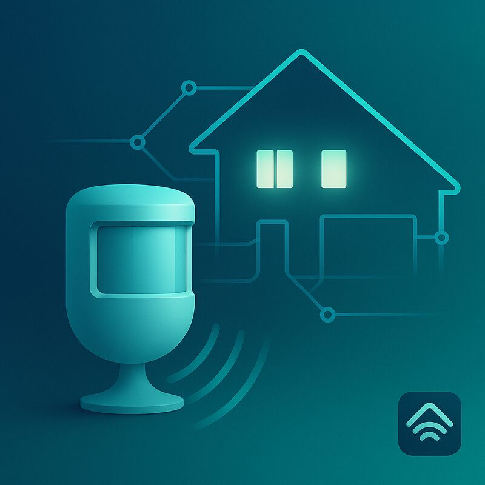

# homebridge-http-motion-sensor

[](https://github.com/lucavb/homebridge-http-motion-sensor/actions/workflows/ci.yml)

<div align="center">
  
  <br>
  <em>HTTP-triggered motion sensor for your smart home</em>
</div>

> **⚠️ BREAKING CHANGE NOTICE**  
> **Version 2.0.0+ requires configuration migration!**
>
> This plugin has been converted from an **accessory plugin** to a **platform plugin**. If you're upgrading from v1.x, you **MUST** update your Homebridge configuration. See the [Migration Guide](#migration-from-v1x) below.
>
> **Old**: Configured in `"accessories"` array  
> **New**: Configured in `"platforms"` array

This plugin offers you a motion sensor that can be triggered via an HTTP request. This can be used in conjunction with an ESP8266 for instance or an Arduino with an ethernet shield. See the [ESP8266 example](esp8266/sensor.ino) in this repository.

## Upcoming v3.0.0

Version **3.0.0** will migrate this plugin to `DynamicPlatformPlugin`. **Accessory UUIDs will change** — you may need to remove duplicate motion sensors from the Home app and re-link automations after upgrading.

- Config format and HTTP trigger behaviour stay the same
- Optional motion reset timeout and HTTP authentication are planned for v3
- Stay on **2.x** if you want zero HomeKit disruption; upgrade to v3 when you are ready

You will see a warning in the Homebridge logs on startup from v2.2 onward.

## What's New in v2.2.0

- **Homebridge 2.1 ready**: Dual ESM/CJS build via tsdown; tested with Homebridge 2.1
- **Homebridge 1.x support preserved**: CommonJS entry via `dist/index.cjs`
- **Modern toolchain**: Vitest unit tests, shelly-ds9-style CI, husky pre-commit hooks
- **API cleanup**: `.onGet()` for motion state reads, improved config validation
- **Static platform preserved**: Existing HomeKit accessory UUIDs unchanged on 2.x

## What's New in v2.0.0

This version has been completely modernized to use the latest Homebridge APIs and best practices, following the [official Homebridge documentation](https://developers.homebridge.io/#/api/platform-plugins):

- **🏗️ Platform Plugin Architecture**: Converted from accessory plugin to platform plugin as recommended by Homebridge developers
- **📦 Multiple Sensor Support**: Configure multiple HTTP motion sensors in a single platform
- **⬆️ Updated for Homebridge 1.6+ and 2.x**: Compatible with Homebridge 2.1 via dual-module publish
- **🗑️ Removed deprecated dependencies**: Eliminated `homebridge-ts-helper` dependency and use modern Homebridge APIs directly
- **✨ Enhanced Configuration UI**: Rich configuration schema with validation and user-friendly forms
- **🛡️ Better error handling**: Enhanced HTTP server error handling and configuration validation
- **🧹 Cleaner codebase**: Improved code structure, better TypeScript types, and modern async patterns
- **📊 Better logging**: More informative debug and info logging throughout the plugin
- **🧪 Comprehensive Testing**: CI-ready test suite with automated functional testing

### Breaking Changes

⚠️ **Configuration Format Changed**: The plugin now uses platform configuration instead of accessory configuration.

- **Requires Homebridge 1.6.0 or later** (including Homebridge 2.1)
- **Node.js 22.12+ or 24+ required**
- **Migration required**: See migration guide below

### Homebridge v2.0 Compatibility

✅ This plugin is **fully compatible** with both Homebridge v1.x and v2.0:

- Uses modern HAP-NodeJS APIs (no deprecated patterns)
- Follows current Homebridge platform plugin best practices
- Tested with Homebridge v2.0 beta releases
- Ready for Homebridge v2.0 stable release

Users will see a **green checkmark** in the Homebridge UI readiness check when using this plugin with Homebridge v2.0.

### Migration from v1.x

⚠️ **REQUIRED CONFIGURATION CHANGE**: This plugin now uses platform configuration instead of accessory configuration.

**Follow these steps to migrate:**

1. **Remove the old accessory configuration** from your `"accessories"` array
2. **Add the new platform configuration** to your `"platforms"` array
3. **Restart Homebridge**

#### Old Configuration (Accessory) - ❌ Remove This:

```json
{
    "accessories": [
        {
            "accessory": "http-motion-sensor",
            "name": "Hallway Motion Sensor",
            "port": 18089
        }
    ]
}
```

#### New Configuration (Platform) - ✅ Add This:

```json
{
    "platforms": [
        {
            "platform": "HttpMotionSensorPlatform",
            "name": "HTTP Motion Sensor Platform",
            "sensors": [
                {
                    "name": "Hallway Motion Sensor",
                    "port": 18089
                }
            ]
        }
    ]
}
```

**🎉 Benefits of the new platform configuration:**

- Support for multiple motion sensors in one configuration
- Better resource management and performance
- Enhanced configuration UI with validation
- Future-proof architecture following Homebridge best practices

## Installation

Run the following command

```
npm install -g homebridge-http-motion-sensor
```

Chances are you are going to need sudo with that.

## Config.json

This plugin now uses the **platform plugin** architecture for better flexibility and multiple sensor support. Here's an example configuration:

```json
{
    "platforms": [
        {
            "platform": "HttpMotionSensorPlatform",
            "name": "HTTP Motion Sensor Platform",
            "sensors": [
                {
                    "name": "Hallway Motion Sensor",
                    "port": 18089,
                    "serial": "E642011E3ECB",
                    "model": "ESP8266 Motion Sensor",
                    "bind_ip": "0.0.0.0",
                    "repeater": [
                        {
                            "host": "192.168.2.11",
                            "port": 22322,
                            "path": "/turnonscreentilltimeout",
                            "auth": "Bearer your-token-here"
                        }
                    ]
                },
                {
                    "name": "Garden Motion Sensor",
                    "port": 18090,
                    "serial": "F642011E3ECC",
                    "model": "ESP8266 Motion Sensor"
                }
            ]
        }
    ]
}
```

### Platform Configuration

| Key      | Description                                                 |
| -------- | ----------------------------------------------------------- |
| platform | Required. Must be `"HttpMotionSensorPlatform"`              |
| name     | Required. The name of this platform instance                |
| sensors  | Required. Array of motion sensor configurations (see below) |

### Sensor Configuration

| Key      | Description                                                                                                                                                                                                                                                               |
| -------- | ------------------------------------------------------------------------------------------------------------------------------------------------------------------------------------------------------------------------------------------------------------------------- |
| name     | Required. The name of this motion sensor. This will appear in your HomeKit app                                                                                                                                                                                            |
| port     | Required. The port that you want this sensor to listen on. Choose a number above 1024 and make sure each sensor uses a different port                                                                                                                                     |
| model    | Optional. Model name displayed in HomeKit                                                                                                                                                                                                                                 |
| serial   | Optional. Serial number displayed in HomeKit. If not provided, a default will be used                                                                                                                                                                                     |
| bind_ip  | Optional. IP address to bind the HTTP server to. Defaults to "0.0.0.0" (all interfaces)                                                                                                                                                                                   |
| repeater | Optional. Array of endpoints to call when motion is detected. Each entry will trigger an HTTP GET request. Useful for triggering other devices or services. See [Node.js HTTP documentation](https://nodejs.org/api/http.html#http_http_get_options_callback) for details |

### Repeater Configuration

| Key  | Description                                                                            |
| ---- | -------------------------------------------------------------------------------------- |
| host | Required. Hostname or IP address of the target server                                  |
| port | Required. Port number of the target server                                             |
| path | Required. URL path to request (e.g., "/api/trigger")                                   |
| auth | Optional. Authorization header value (e.g., "Bearer token123" or "Basic dXNlcjpwYXNz") |

## Benefits of Platform Plugin Architecture

- **Multiple Sensors**: Configure multiple motion sensors in a single platform
- **Better Resource Management**: Shared platform resources and better lifecycle management
- **Future-Proof**: Follows modern Homebridge best practices
- **Enhanced Configuration**: Rich configuration UI with validation
- **Improved Logging**: Better debugging and monitoring capabilities

### Homebridge 2.x Compatibility

This plugin ships a dual ESM/CJS build and declares `engines.homebridge: ^1.6.0 || ^2.0.0`. Users should see a green checkmark in the Homebridge UI readiness check on Homebridge 2.x.

## Testing

### Unit tests (Vitest)

```bash
npm test
```

CI uses `npm run test:ci` for verbose output.

### Integration tests (Homebridge + HTTP)

End-to-end tests boot Homebridge and exercise the HTTP motion sensors:

```bash
npm run test:integration
```

Requires global `homebridge`, `curl`, and `nc` (netcat).

### Full local gate (matches CI)

```bash
npm run cq && npm run test:ci && npm run test:integration
```

The integration suite will:

- Build the plugin
- Start a test Homebridge instance
- Create two test motion sensors on ports 18089 and 18090
- Test motion detection and reset functionality
- Verify HTTP responses, multiple requests, and different endpoints
- Test motion reset after timeout
- Show logs and optionally keep Homebridge running for manual testing

For CI environments (no interactive prompts), `test:integration` is used automatically.
